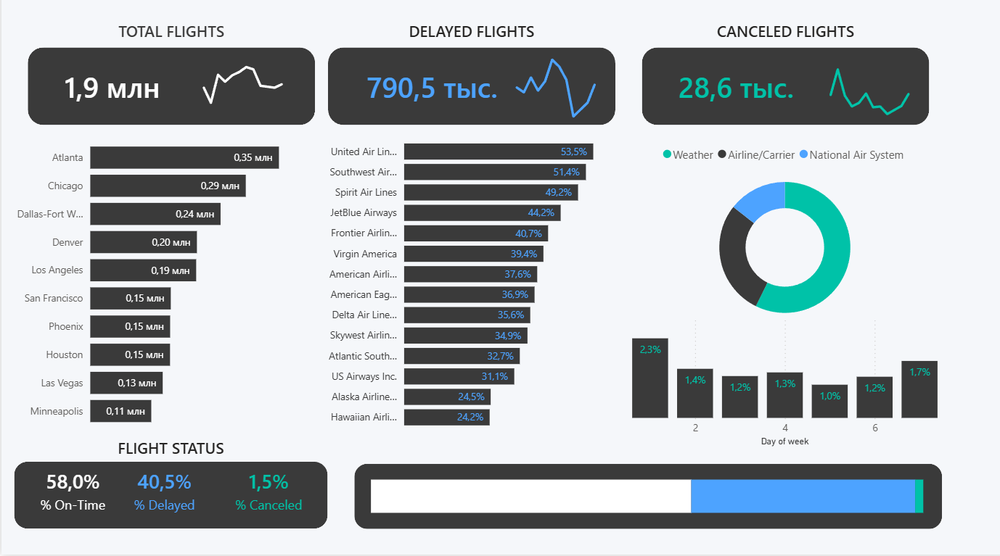
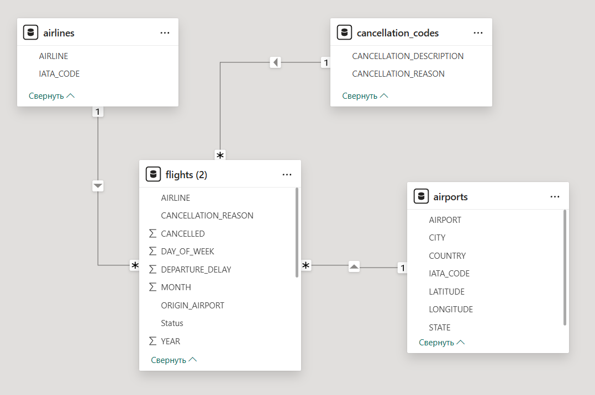

# flight-status-dashboard | Power BI

## Обзор проекта

Данный проект посвящён анализу данных о полётах и разработке интерактивного бизнес-дашборда в Microsoft Power BI Desktop.

---

## Используемые инструменты и технологии

- Microsoft Excel
- ИНДЕКС, ПОИСКПОЗ;
- Сводные таблицы (Pivot tables)
- Cводные диаграммы (Pivot Charts) 
- Временная шкала (Timeline)
- Очистка и подготовка данных
- Визуализация данных
- Dashboard Design

---

## Этапы работы над проектом

### 1. Подготовка данных
- анализ структуры исходного датасета;
- очистка и форматирование данных (Power Query);
- стандартизация значений;
- подготовка данных для дальнейшего анализа.

### 2. Построение модели данных
- одна таблица фактов (flight), несколько таблиц измерений;
- связи 1:М;
- модель данных "звезда"

### 3. Добавление мер (DAX)
- создание мер общего подсчёта количества рейсов (Total flight m);
- создание мер для подсчёта задержанных и отмененных рейсов (Delayed Flight m, Canceled Flight m)  
- создание мер для определения упомянутых типов рейсов в проценстном соотношении.

### 4. Разработка дашборда
- создание гистограм и кольцевого графика;
- создание карточек;
- подключение корректных данных;
- изменение взаимодействия;
- дизайн дашборда.
  
---

## Ключевые выводы

- самыя частая причина отмены рейса -- погодные условия;
- United Air Lines Inc -- самое большое часло задержанных рейсов;
- Чаще всего люди летают из города Antlanta.

Thanks Chris Dutton from Maven Analytics for such great tutorial: https://www.youtube.com/watch?v=aLV4Qe60VK4

